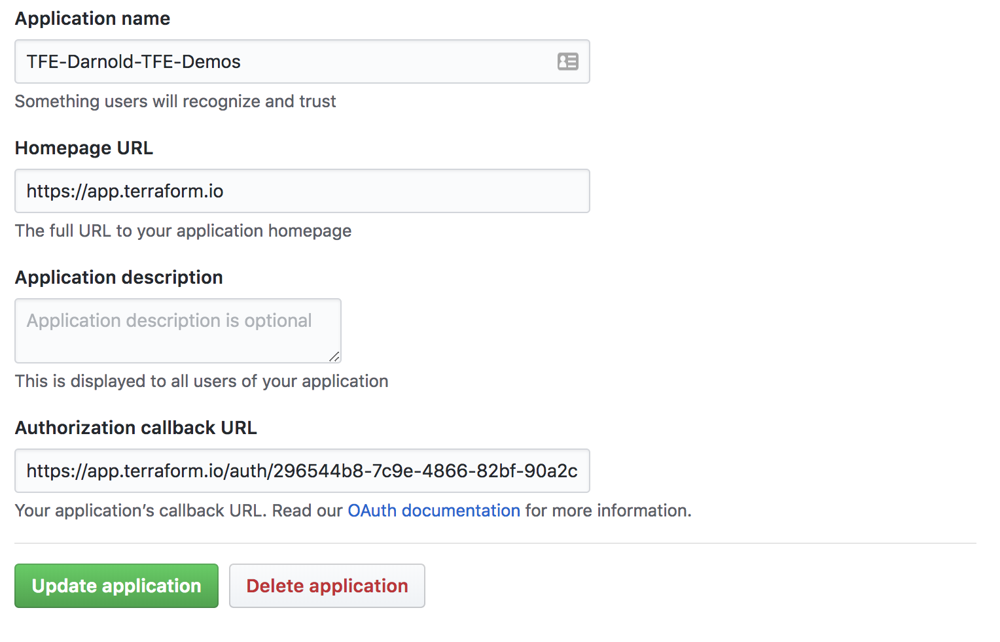

# tfe-demo

This repository is meant to serve as a standardized demo for Terraform Enterprise. Anybody interested in demonstrating features and functionality of Terraform Enterprise should be able to quickly eand easily setup a new organization and workspaces by following the documentation here.

## Credentials
The code in this repository assumes that values for credentials are stored in a Vault server. 

### Github Credentials
The credentials can be anywhere in Vault, but must have the following schema. 
The location of the credentials is specified by setting the vault_github_tokens variable. The Default location is secret/credentials/github. These credentials are used to setup a VCS Connection to your Terraform Enterprise Organization.
```json
{
    "key": "<oauth_app_client_id>",
    "secret": "<oauth_app_client_secret>"
}
```
Code from the deploy, image, and network modules will look for Github Environment Variables. These variables will be used by the github provider to clone the source repos and create new repos in 
specified users github account. 
```bash
export GITHUB_ORGANIZATION=${ORG}
export GITHUB_TOKEN=${TOKEN}
```


### Azure Credentials
The credentials can be anywhere in Vault, but must have the following schema.
The location of the credentials is specified by setting the vault_azure_credentials_path variable. The Default location is secret/credentials/azure. These credentials are used as variables in the newly created workspaces as the workspaces work together to bake an image using Packer, and then launch into Azure.
```json
{
    "client_id": "${ARM_CLIENT_ID}",
    "client_secret": "${ARM_CLIENT_SECRET}",
    "subscription_id": "${ARM_SUBSCRIPTION_ID}",
    "tenant_id": "${ARM_TENANT_ID}"
}
```

### Terraform Enterprise Credentials
These credentials are not stored in Vault, instead these are stored on the local system. Normally, users will create the API Token in Terraform and store in a ~/.terraformrc file. This file has the schema:
```hcl
credentials "app.terraform.io" {
  token = "<USER_API_TOKEN>"
}
```
This needs to be a User token and not an Org token. 

### Vault Credentials
It is expected to have VAULT_ADDR and VAULT_TOKEN set as your environment variables. The Terraform Vault Provider will use these variables to authentcate against the Vault server in order to look up the Github and Azure credentials.


# Usage
## Organzation Setup
### Create Organization
First, you'll want to create an organization. You will do this by changing into the setup/organizations directory and running `terraform apply`. You will need to specify the name of the organization. and the admin email address.
```bash
terraform apply -var organization=Darnold-Demos-Trial -var organization_admin_email darnold@hashicorp.com
```

### Wire up the VCS Connection
After creating the organization, you will need to do a few tasks manually. *this is subject to change as the Terraform Development team is working to provide a few more terraform resources that will take care of this.

First, in your browser, open the following url.
```bash
https://app.terraform.io/app/${TFE_ORG}/settings/version-control
```


Copy the Callback URL and use it to add to the Oauth App Callback in Github.




### Retrieve Token
Once you have created the new organization and have wired up the VCS Connection. You will need to retrieve your OAuth Token. You will use the included script, oauth_tokens.py in order to retrieve your oauth token. 
```bash
python oauth_tokens.py --org=Darnold-Demos-Trial
# Response:
Token: <token>
```

## Workspace Setup
### Create Workspaces
```yaml
Variables:
env: Name of Resource Group in Azure
oath_token: Token as output from oauth_tokens.py script
organization: Name of Terraform Enterprise Organization as created from previous steps.
```
```bash
cd workspaces;
terraform apply -var env=<env> -var oauth_token=<oauth_token> -var organization=<organization>
```
